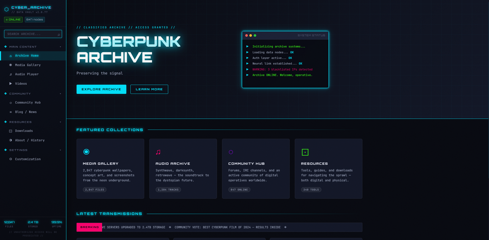

# CYBERPUNK ARCHIVE

A fully functional, neon-drenched digital archive website celebrating cyberpunk culture. Built with vanilla HTML, CSS, and JavaScript — no frameworks, no build tools, no dependencies. Just pure dystopian vibes.



**Features:** Sidebar navigation • Media gallery with lightbox • Audio player with visualizer • Blog/news • Community guestbook • Customizable themes • localStorage persistence • Fully responsive

## What is this?

Think of it as a museum of the digital underground. It's got:
- **9 fully functional pages** (Home, Gallery, Audio Player, Videos, Community, Blog, Downloads, About, Settings)
- **A slick sidebar** with collapsible nav groups and live search
- **A working audio player** with playlist, shuffle, repeat, visualizer bars
- **Image gallery** with lightbox and category filters
- **Guestbook** where visitors can sign in
- **5 accent color themes** that you can switch between
- **Customizable effects** — toggle scanlines, glitch, noise, animations
- **localStorage persistence** — your settings stick around
- **Fully responsive** — looks great on desktop, tablet, and mobile
- **Zero external dependencies** — doesn't need npm, webpack, or anything else

## Getting started

### Option 1: Just open it (easiest)
Double-click `index.html` and it opens in your browser. Works immediately.

### Option 2: Run a local server (recommended for full features)
```bash
cd C:\Users\user\Documents\cyberpunk-archive
npx serve
```
Then visit `http://localhost:3000`

Or with Python:
```bash
python -m http.server 8000
# Then visit http://localhost:8000
```

## File structure

```
cyberpunk-archive/
├── index.html          # All HTML — 9 pages, sidebar, lightbox, notifications
├── css/
│   └── styles.css      # ~900 lines of neon styling
├── js/
│   └── app.js          # ~500 lines of interactivity
└── README.md           # You are here
```

### index.html
Contains the full DOM structure:
- Sidebar with collapsible nav groups and search
- 9 page sections (home, gallery, audio, videos, community, blog, downloads, about, settings)
- Lightbox overlay for gallery
- Notification system
- All pages are hidden/shown via JS, not reloaded

### css/styles.css
Implements the cyberpunk aesthetic:
- CSS custom properties for theming (`--acc`, `--bg-0` through `--bg-5`)
- Grid-based layouts with flexbox fallbacks
- Neon glow effects using `box-shadow` and `filter: drop-shadow()`
- Smooth animations with `transition` and `@keyframes`
- Mobile-first responsive design (768px breakpoint for mobile, 480px for small phones)
- Accessibility features: reduced motion, high contrast, compact mode

### js/app.js
Handles all the logic:
- **Data**: Arrays of content (GALLERY_DATA, PLAYLIST_DATA, BLOG_DATA, etc.)
- **State**: Tracks current page, audio playback, user prefs
- **Routing**: Single-page app using URL hash fragments
- **Pages**: Render functions for gallery, playlist, blog, etc.
- **Features**: Audio player, lightbox, search, guestbook, settings
- **Utilities**: Notifications, animations, localStorage persistence

## Features

### 🎨 Sidebar Navigation
- 5 collapsible groups (Main, Community, Resources, Settings)
- Live search across all pages
- Shows archive stats (12,847 files, 2.4TB stored, etc.)
- Fully styled with neon borders and glow effects

### 🖼️ Media Gallery
- 16 placeholder items with gradient backgrounds
- Category filters: All, Wallpaper, Concept, Screenshots, Fan Art
- Lightbox viewer with keyboard navigation (← → Esc)
- Hover effects with overlay info

### 🎵 Audio Player
- 12-track playlist with shuffle and repeat modes
- Animated visualizer bars
- Time scrubbing and current time display
- Album cover carousel with 6 featured releases
- Volume control with mute button

### 📹 Videos
- 6 video cards with play overlay
- Category filter system
- Placeholder design ready for embedded videos

### 👥 Community Hub
- Forums, IRC, Discord cards
- Live guestbook with real submission (stored in localStorage)
- Sign and view other visitor messages

### 📰 Blog/News
- 5 article cards with emoji banners and metadata
- Category tags (News, Release, Art, Community, Tech)
- Sidebar with tag cloud and archive stats

### 📥 Downloads
- 4 resource categories (Wallpapers, Tools, Audio, Guides)
- File listings with size/format info

### ℹ️ About/History
- Timeline of archive milestones
- Contributor avatars
- ASCII art and tech stack info

### ⚙️ Settings
- **Theme picker**: 5 neon accent colors (Cyan, Magenta, Green, Purple, Orange)
- **Effects toggles**: Scanlines, glitch, noise, animations
- **Accessibility**: Reduced motion, high contrast modes
- **Sidebar**: Compact mode option
- **Export/Reset**: Download or reset all preferences

## Customization

### Adding a new page
1. Add a new `<section class="page">` in index.html
2. Give it an ID like `id="page-mypage"`
3. Add a nav link in the sidebar: `<a class="nav-link" href="#mypage" data-page="mypage">Label</a>`
4. Create a render function in app.js if it needs dynamic content
5. The routing system picks it up automatically

### Adding new colors
In `styles.css`, create a new theme class:
```css
.theme-lime {
  --acc: #00ff00;
  --acc-dim: rgba(0,255,0,0.12);
  --acc-glow: 0 0 8px #00ff00, 0 0 24px rgba(0,255,0,0.25);
}
```
Then add a swatch button in the Settings page.

### Changing content
Edit the data arrays in `app.js`:
- `GALLERY_DATA`: Gallery items
- `PLAYLIST_DATA`: Audio tracks
- `BLOG_DATA`: Blog posts
- `DOWNLOAD_DATA`: Resource files
- `CONTRIBUTORS`: About page team members

### Tweaking the vibe
- **Speed**: Change `--trans: 0.25s` and `--trans-slow: 0.5s` in styles.css
- **Glow intensity**: Adjust `box-shadow` values (the `0 0 20px rgba(...)` part)
- **Sidebar width**: Change `--sidebar-w: 260px` in styles.css
- **Colors**: Use the CSS custom properties for consistent theming

## Browser support

Works in all modern browsers:
- Chrome/Edge 88+
- Firefox 87+
- Safari 14+
- Mobile browsers (iOS Safari, Chrome Mobile)

## Technical notes

### Why vanilla JS?
- **No build process**: Just open and go
- **Easy to understand**: No framework abstractions
- **Easy to modify**: One file, everything in scope
- **No dependency bloat**: 500 lines vs 300KB of framework code

### How the audio player works
- UI is functional (play/pause, seek, volume)
- Actual audio playback is simulated with JS timers
- To connect real audio: replace the `tickPlayer()` function with Web Audio API calls

### Storage
- User preferences (theme, effects) stored in `localStorage` as JSON
- Guestbook entries also stored locally (not synced to server)
- Data persists across browser sessions

### Performance
- CSS animations use `transform` and `opacity` for GPU acceleration
- Lazy rendering for gallery and blog
- No external API calls or network requests

## Troubleshooting

**Page doesn't load**: Make sure you're running a server (even `python -m http.server`) or opening the file with a file:// URL. Some features require HTTP.

**Audio player isn't playing actual sound**: That's normal — it's currently a UI/UX mock-up. To add real audio, connect the Web Audio API or an `<audio>` element in the render functions.

**Mobile nav broken**: Clear your browser cache. localStorage might be holding old prefs.

**Settings not saving**: Check if localStorage is enabled in your browser. Some private/incognito modes disable it.

## Ideas for extension

- **Real audio**: Hook up Web Audio API for actual playback
- **Image upload**: Replace placeholder gradient items with real image uploads
- **Backend**: Add a Node.js/Express server to store guestbook, uploads, etc.
- **Comments**: Add comment sections to blog posts
- **Dark mode**: Add a light mode variant (or go full neon)
- **Analytics**: Track which pages users visit most
- **PWA**: Add service worker for offline support
- **Animation library**: Use Framer Motion or GSAP for smoother effects

## License

Built with ❤️ for the digital underground. Use it however you want — it's yours.

---

**Made for everyone who dreams of neon-soaked cities and digital rebellion.** 🟡🔴🟣

Visit the site. Browse the archive. Sign the guestbook. Customize your theme. And remember: in the sprawl, the signal is everything.
