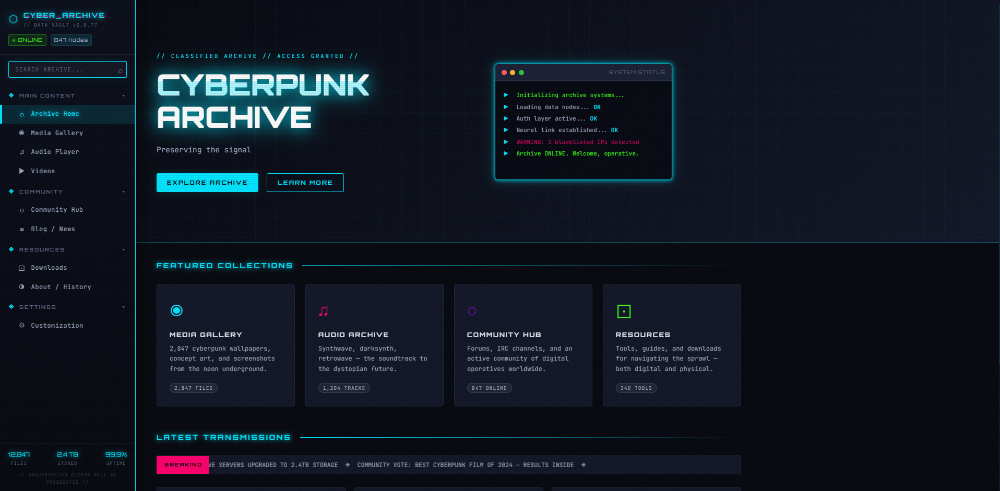

# Cyberpunk Archive

A designed interface for a fictional media archive, backed by a real SQLite API.



Ten pages of neon-terminal UI — gallery, audio player, video library, blog, community, settings — built as a vanilla HTML/CSS/JS frontend over a small Express + SQLite backend. Images are pulled from Unsplash. Audio and video play through the YouTube IFrame API.

The archive's *content* is invented: the file counts, contributors, blog posts, and downloads are set dressing. The infrastructure underneath is not.

---

## Architecture

Two things here are worth more than the styling.

**The frontend degrades to a static site.** Every data-backed view — gallery, playlist, videos — tries its API endpoint first and falls back to a hardcoded array on any failure:

```js
try {
  const res = await fetch('/api/gallery');
  if (!res.ok) throw new Error(`API error: ${res.status}`);
  renderFromDatabase(await res.json());
} catch (err) {
  console.warn('API unavailable, using placeholder data:', err.message);
  renderFromPlaceholders(GALLERY_DATA);
}
```

So `index.html` opened straight off disk, with no Node installed, is a working site with gradient placeholders. Start the server and the same views fill with real Unsplash photos and a seeded playlist. One codebase, two modes, no build step in either.

**SQLite comes from Node itself.** `node:sqlite` (Node 22.5+, behind `--experimental-sqlite`) means no `better-sqlite3`, no native compilation, no prebuilt binaries to fight. Total dependency count is three: `express`, `cors`, `dotenv`.

The audio player keeps a single YouTube iframe alive across navigation by physically moving the DOM node into a mini-player when you leave the audio page, so playback doesn't cut when you browse elsewhere.

---

## Requirements

- **Node.js 22.5.0 or newer** — required for `node:sqlite`
- An [Unsplash API key](https://unsplash.com/developers) (free tier: 50 requests/hour) if you want real gallery images

---

## Quick start

### Static only — no install

Open `index.html` in a browser. Everything renders from the built-in placeholder data. Themes, routing, lightbox, and settings all work.

### Full stack

```bash
npm install
cp .env.example .env        # then paste your Unsplash key into it
npm run seed                # fetch ~250 images from Unsplash into SQLite
npm run seed:playlist       # seed the Cyberpunk 2077 soundtrack
npm run seed:1980           # seed the Cyberpunk 1980 synthwave playlist
npm run seed:videos         # seed the video library
npm run dev                 # http://localhost:3000
```

`npm run dev` watches for changes; `npm start` doesn't. The database file is created automatically at `database/archive.db` and is gitignored.

Re-running the seeds is safe — gallery inserts use `INSERT OR IGNORE` keyed on the Unsplash photo ID, and the playlist seeds clear their own rows first.

---

## API

| Method | Endpoint | Notes |
|---|---|---|
| `GET` | `/api/gallery` | Supports `?category=` (`wallpaper`, `concept`, `screenshot`, `fanart`) and `?limit=` |
| `GET` | `/api/gallery/categories` | Image count per category |
| `GET` | `/api/gallery/:id` | Single image |
| `GET` | `/api/playlist` | Supports `?name=Cyberpunk+2077` |
| `GET` | `/api/playlist/names` | Distinct playlist names |
| `GET` | `/api/videos` | Supports `?category=` |
| `GET` | `/api/health` | Status and timestamp |

Unmatched routes serve `index.html` so client-side hash routing works on refresh.

---

## Structure

```
cyberpunk-archive/
├── index.html              # All 10 page sections, sidebar, lightbox, notifications
├── css/styles.css          # ~2,400 lines — theming, layout, effects
├── js/app.js               # ~1,400 lines — routing, players, rendering, prefs
└── server/
    ├── server.js           # Express app, static + API
    ├── db.js               # node:sqlite connection and schema
    ├── routes/             # gallery.js, playlist.js, videos.js
    └── seed*.js            # Unsplash fetch + playlist/video seeds
```

Pages are `<section class="page">` elements shown and hidden by hash-fragment routing — nothing reloads.

---

## Customizing

**Themes** are CSS custom properties. Add a class in `styles.css` and a swatch in the Settings page:

```css
.theme-lime {
  --acc: #00ff00;
  --acc-dim: rgba(0,255,0,0.12);
  --acc-glow: 0 0 8px #00ff00, 0 0 24px rgba(0,255,0,0.25);
}
```

Other knobs live in `:root` — `--sidebar-w`, `--trans`, `--trans-slow`.

**Adding a page:** add a `<section class="page" id="page-yours">`, add a sidebar link with `href="#yours" data-page="yours"`, and the router picks it up. Add a render function in `app.js` only if it needs dynamic content.

**Placeholder content** lives in the `GALLERY_DATA`, `PLAYLIST_DATA`, `BLOG_DATA`, `DOWNLOAD_DATA`, and `CONTRIBUTORS` arrays at the top of `app.js`. These are the fallback set — the database overrides them when the server is up.

---

## Known limitations

- The guestbook writes to `localStorage`, not the database. Entries are per-browser and not shared between visitors.
- Blog posts and downloads are static arrays with no backing table. The download links don't resolve to files.
- Audio and video playback both depend on YouTube embeds, so they need a network connection and are subject to region blocks and takedowns.
- The Unsplash free tier caps at 50 requests/hour. A full `npm run seed` uses 8.
- Cyberpunk 2077 titles, artwork references, and soundtrack are property of CD Projekt Red and the respective artists. This is a fan project.

## Browser support

Chrome/Edge 88+, Firefox 87+, Safari 14+, and current mobile browsers. Responsive down to 480px.

## License

MIT — see [LICENSE](./LICENSE).
